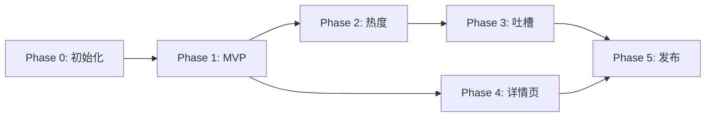

# NBA-TUI 开发计划

> 终端里的 NBA 全美战场地图 + 实时社交吐槽神器

## 项目概览

| 项目 | 说明 |
|------|------|
| **TUI 框架** | TypeScript + @opentui/react + Bun |
| **数据服务** | Python (FastAPI) 统一数据层 |
| **NBA 数据** | [nba_api](https://github.com/swar/nba_api) - NBA官方数据，免费无限制 |
| **社交数据** | snscrape / twscrape |
| **目标用户** | 社区开源发布 |

---

## 架构设计

```
┌─────────────────────┐         HTTP          ┌────────────────────────────────┐
│   NBA-TUI           │ ◄───────────────────► │   nba-data-service (Python)    │
│   (Bun/TypeScript)  │   localhost:8765      │   ├── /games    (nba_api)      │
│   纯渲染层 + 交互    │                       │   ├── /scores   (nba_api)      │
└─────────────────────┘                       │   ├── /heat     (snscrape)     │
                                              │   └── /tweets   (snscrape)     │
                                              └────────────────────────────────┘
```

**架构优势**：
- ✅ **数据层全 Python** - 你最熟悉的语言
- ✅ **无 API Key 需求** - nba_api 直接访问 NBA 官方数据
- ✅ **无速率限制** - 合理使用即可，30秒轮询完全没问题
- ✅ **TUI 专注渲染** - TypeScript 端只负责展示和交互
- ✅ **解耦部署** - 数据服务可独立运行、调试
- ✅ **社交可选** - 用户可选择是否启用社交功能

---

## 技术选型说明

### TUI 框架 (OpenTUI)
- 使用 `@opentui/react` 作为 TUI 框架
- 创建项目：`bun create tui nba-tui`
- ⚠️ **前置依赖**：需要安装 [Zig](https://ziglang.org/learn/getting-started/) 来构建

### NBA 数据源 (nba_api)

> [!TIP]
> `nba_api` 是 NBA 官方数据的 Python 包装器，完全免费且功能强大

**核心功能**：
- ✅ **Live Scoreboard** - 实时比分 `nba_api.live.nba.endpoints.scoreboard`
- ✅ **球队/球员信息** - 静态数据，减少请求
- ✅ **Box Score** - 详细比赛统计
- ✅ **Play-by-Play** - 实时回放数据
- ✅ **无 API Key** - 直接使用
- ✅ **无官方速率限制** - 合理使用即可

**示例代码**：
```python
from nba_api.live.nba.endpoints import scoreboard

# 获取今日所有比赛实时比分
games = scoreboard.ScoreBoard()
print(games.get_dict())
```

### 社交数据 (snscrape)
- 与 NBA 数据服务整合在同一个 Python 服务中
- 免费抓取 Twitter/X 数据
- 无需 API Key

---

## Phase 0：项目初始化

### 0.1 环境准备
- [ ] 安装 Zig 编译器（OpenTUI 依赖）
- [ ] 确认 Bun 版本 >= 1.0
- [ ] 确认 Python 版本 >= 3.10
- [ ] 创建 Python 虚拟环境

### 0.2 TUI 项目创建
- [ ] `bun create tui nba-tui` 选择 React 模板
- [ ] 安装核心依赖：
  ```bash
  bun add zustand date-fns
  bun add -d @types/node typescript
  ```

### 0.3 Python 数据服务创建
- [ ] 创建 `data-service/` 目录
- [ ] 创建虚拟环境：`python -m venv venv`
- [ ] 安装依赖：
  ```bash
  pip install nba_api fastapi uvicorn snscrape
  ```

### 0.4 目录结构
```
nba-tui/
├── src/                      # TUI 应用 (TypeScript)
│   ├── components/
│   │   ├── MapBackground.tsx
│   │   ├── GameCard.tsx
│   │   ├── TweetBubble.tsx
│   │   └── HeatIndicator.tsx
│   ├── pages/
│   │   ├── MapView.tsx
│   │   └── GameDetail.tsx
│   ├── hooks/
│   │   ├── useGames.ts
│   │   ├── useSocialHeat.ts
│   │   └── useKeyboard.ts
│   ├── store/
│   │   └── index.ts
│   ├── data/
│   │   ├── teamCoords.ts
│   │   ├── teamColors.ts
│   │   └── usMap.ts
│   ├── services/
│   │   └── apiClient.ts      # 统一 HTTP 客户端
│   ├── utils/
│   │   ├── formatters.ts
│   │   └── colors.ts
│   └── App.tsx
│
├── data-service/             # Python 数据服务
│   ├── main.py               # FastAPI 入口
│   ├── routers/
│   │   ├── games.py          # NBA 比赛数据路由
│   │   └── social.py         # 社交数据路由
│   ├── services/
│   │   ├── nba_service.py    # nba_api 封装
│   │   └── social_service.py # snscrape 封装
│   ├── models/
│   │   └── schemas.py        # Pydantic 数据模型
│   ├── requirements.txt
│   └── README.md
│
├── scripts/
│   ├── start-all.sh          # 一键启动脚本
│   └── dev.sh                # 开发模式脚本
│
├── .env.example
├── package.json
└── README.md
```

### 0.5 配置文件
- [ ] 创建 `.env.example`：
  ```env
  # 数据服务配置
  DATA_SERVICE_URL=http://localhost:8765
  DATA_SERVICE_PORT=8765
  
  # 刷新间隔
  GAME_REFRESH_INTERVAL_MS=30000
  HEAT_REFRESH_INTERVAL_MS=300000
  
  # 功能开关
  ENABLE_SOCIAL_FEATURES=true
  ```

### 0.6 启动脚本
- [ ] 创建 `scripts/start-all.sh`：
  ```bash
  #!/bin/bash
  # 启动 Python 数据服务
  cd data-service && uvicorn main:app --port 8765 &
  
  # 等待服务启动
  sleep 2
  
  # 启动 TUI
  cd .. && bun run start
  ```

---

## Phase 1：ASCII 地图 + 当天比赛卡片 (MVP)

> **目标**：实现核心"地图战场"视觉效果 + 实时比分

### 1.1 Python 数据服务 - NBA 模块
- [ ] 创建 `data-service/services/nba_service.py`
  ```python
  from nba_api.live.nba.endpoints import scoreboard
  from nba_api.stats.static import teams
  
  class NBAService:
      def get_today_games(self) -> list:
          """获取今日所有比赛"""
          board = scoreboard.ScoreBoard()
          return board.get_dict()["scoreboard"]["games"]
      
      def get_all_teams(self) -> list:
          """获取所有球队信息（静态数据）"""
          return teams.get_teams()
  ```

- [ ] 创建 `data-service/routers/games.py`
  ```python
  from fastapi import APIRouter
  
  router = APIRouter(prefix="/games", tags=["games"])
  
  @router.get("/today")
  async def get_today_games():
      """获取今日比赛列表"""
      ...
  
  @router.get("/live")
  async def get_live_scores():
      """获取实时比分"""
      ...
  ```

- [ ] 错误处理 + 重试逻辑
- [ ] 响应缓存（避免重复请求，设置 TTL）

### 1.2 ASCII 美国地图
- [ ] 创建 `src/data/usMap.ts`
  - 固定宽度 ASCII 美国地图（约 80-100 列）
  - 使用 dim 灰色作为背景色
  - 标注关键城市参考点

### 1.3 球队坐标映射
- [ ] 创建 `src/data/teamCoords.ts`
  - 30 支球队 → 地图坐标映射表
  - 使用**百分比坐标**（0-100），适配不同终端尺寸
  - 特殊处理：
    - LA 双队（Lakers 左偏，Clippers 右偏）
    - 纽约双队（Knicks 曼哈顿，Nets 布鲁克林）
    - 湾区（Warriors 旧金山位置）

  ```typescript
  export const teamCoords: Record<string, { x: number; y: number }> = {
    LAL: { x: 12, y: 58 },  // Lakers - 稍左
    LAC: { x: 14, y: 60 },  // Clippers - 稍右下
    GSW: { x: 8, y: 42 },   // Warriors
    // ... 全部 30 队
  };
  ```

### 1.4 球队颜色
- [ ] 创建 `src/data/teamColors.ts`
  - 每队主色 + 辅色（ANSI 256 色或 RGB）
  ```typescript
  export const teamColors: Record<string, { primary: string; secondary: string }> = {
    LAL: { primary: '#552583', secondary: '#FDB927' },
    BOS: { primary: '#007A33', secondary: '#BA9653' },
    // ...
  };
  ```

### 1.5 API 客户端
- [ ] 创建 `src/services/apiClient.ts`
  ```typescript
  const BASE_URL = process.env.DATA_SERVICE_URL || 'http://localhost:8765';
  
  export async function fetchTodayGames() {
    const res = await fetch(`${BASE_URL}/games/today`);
    return res.json();
  }
  
  export async function fetchLiveScores() {
    const res = await fetch(`${BASE_URL}/games/live`);
    return res.json();
  }
  ```
- [ ] 健康检查逻辑
- [ ] 连接失败时的友好提示

### 1.6 全局状态管理
- [ ] 创建 `src/store/index.ts` (Zustand)
  ```typescript
  interface AppState {
    currentDate: Date;
    games: Game[];
    selectedGameId: string | null;
    isLoading: boolean;
    error: string | null;
    dataServiceConnected: boolean;
    // Actions
    setDate: (date: Date) => void;
    selectGame: (id: string | null) => void;
    fetchGames: () => Promise<void>;
    checkDataService: () => Promise<void>;
  }
  ```

### 1.7 核心组件

#### MapBackground.tsx
- [ ] 渲染 ASCII 地图作为背景层
- [ ] 响应终端尺寸变化，居中显示
- [ ] 最小尺寸检测（< 80 列显示警告）

#### GameCard.tsx
- [ ] 卡片内容：
  - 客队 @ 主队（缩写 + 城市名）
  - 大字体比分
  - 状态徽章（未开始/Q1-Q4/OT/结束）
  - 剩余时间（进行中）
- [ ] 样式：
  - 圆角边框
  - 球队主色调边框
  - 进行中：绿色脉动效果
  - 已结束：灰色淡化

#### HeatIndicator.tsx
- [ ] 热度指示器（Phase 2 占位）
- [ ] 预留火焰图标、闪烁动画接口

### 1.8 主页面 MapView.tsx
- [ ] 组合地图 + 卡片
- [ ] 卡片绝对定位到主队城市坐标
- [ ] 处理卡片重叠（智能偏移）
- [ ] 30 秒自动刷新

### 1.9 键盘交互
- [ ] `←` / `→` 切换日期
- [ ] `↑` / `↓` / `Tab` 在卡片间导航
- [ ] `r` 手动刷新
- [ ] `q` 退出

### 1.10 终端适配
- [ ] 监听终端 resize 事件
- [ ] 地图居中 + 卡片坐标重计算
- [ ] 紧凑模式 fallback（终端太小时）

---

## Phase 2：社交热度热力图

> **目标**：让地图"活"起来，突出全网关注的焦点战

### 2.1 Python 数据服务 - 社交模块
- [ ] 创建 `data-service/services/social_service.py`
  ```python
  import snscrape.modules.twitter as sntwitter
  
  class SocialService:
      def get_game_heat(self, team1: str, team2: str) -> dict:
          """获取比赛讨论热度"""
          query = f'"{team1} {team2}" OR "{team1}" "{team2}"'
          # 统计过去 1 小时推文数
          ...
      
      def get_top_tweets(self, team1: str, team2: str, limit: int = 5) -> list:
          """获取热门吐槽"""
          ...
  ```

- [ ] 创建 `data-service/routers/social.py`
  ```python
  @router.get("/heat/{team1}/{team2}")
  async def get_heat(team1: str, team2: str):
      return {"count": 142, "trending": True, "level": "hot"}
  
  @router.get("/tweets/{team1}/{team2}")
  async def get_tweets(team1: str, team2: str, limit: int = 5):
      return {"tweets": [...]}
  ```

- [ ] 关键词组合逻辑：
  - `"{team1_full} {team2_full}"` OR `"{abbr1} {abbr2}"`
  - 示例：`"Lakers Clippers" OR "LAL LAC"`

### 2.2 TUI 社交 API 客户端
- [ ] 更新 `src/services/apiClient.ts`
- [ ] 健康检查 + 优雅降级（服务不可用时隐藏社交功能）

### 2.3 热度等级定义
| 推文数 | 等级 | 颜色 | 效果 |
|--------|------|------|------|
| 0-10 | 冷门 | 灰色 | 无 |
| 11-50 | 一般 | 蓝色 | 边框高亮 |
| 51-200 | 热门 | 黄色 | 边框 + 背景 |
| 200+ | 爆火 | 红色 | 闪烁 + 🔥图标 |

### 2.4 热度可视化
- [ ] 更新 `GameCard.tsx` 支持热度边框颜色
- [ ] 更新 `HeatIndicator.tsx` 渲染火焰图标
- [ ] Top 3 热门比赛自动放大卡片

### 2.5 热度刷新
- [ ] 每 5 分钟刷新一次热度数据
- [ ] 热度突变动画（渐变过渡）

---

## Phase 3：神吐槽气泡 + 交互增强

> **目标**：增加社区乐趣，让用户一边看地图一边笑出声

### 3.1 TweetBubble 组件
- [ ] 漫画风格对话气泡
- [ ] 绝对定位在卡片右侧/上方
- [ ] 内容：1-3 条高赞推文
- [ ] 10 秒自动轮换

### 3.2 推文过滤规则
- [ ] 幽默关键词：`lmao`, `dead`, `insane`, `clutch`, `cooked`
- [ ] 最低点赞数：20
- [ ] 简单脏话过滤
- [ ] 长度限制（适配气泡宽度）

### 3.3 交互增强
- [ ] `t` 键：显示/刷新当前选中比赛的吐槽
- [ ] `Enter` 键：进入比赛详情页（预留）
- [ ] 鼠标 hover 卡片显示简要吐槽

---

## Phase 4：比赛详情页 + 扩展功能

### 4.1 Python 扩展 API
- [x] `/games/{game_id}/boxscore` - Box Score 数据
- [x] `/games/{game_id}/playbyplay` - Play-by-Play 数据
- [x] `/standings` - 联盟排名

### 4.2 GameDetail 页面
- [x] Box Score 表格
- [x] 球员统计（得分、篮板、助攻排序）
- [x] 实时 play-by-play

### 4.3 联盟排名侧边栏
- [x] 东西部排名
- [x] 可切换显示/隐藏

### 4.4 搜索功能
- [ ] 球员搜索
- [ ] 球队搜索
- [ ] 历史日期快速跳转

### 4.5 主题系统
- [ ] 暗色主题（默认）
- [ ] 亮色主题
- [ ] 球队配色主题（跟随选中球队）

---

## Phase 5：优化与发布

### 5.1 交互完善
- [ ] 完整鼠标支持
- [ ] 滚动优化
- [ ] 动画性能优化

### 5.2 健壮性
- [ ] Python 服务缓存层（Redis 可选）
- [ ] 错误边界
- [ ] 离线模式（显示缓存数据）
- [ ] 重试队列

### 5.3 发布准备
- [ ] README.md（含 GIF 演示）
- [ ] CONTRIBUTING.md
- [ ] LICENSE (MIT)
- [ ] Docker Compose 配置（一键部署）
- [ ] GitHub Actions CI

### 5.4 社区运营
- [ ] 炫酷终端截图/GIF
- [ ] 发布到 Reddit r/nba、r/commandline
- [ ] Product Hunt 提交

---

## 里程碑时间线（建议）

| 阶段 | 预计工期 | 交付物 |
|------|----------|--------|
| Phase 0 | 1 天 | 项目骨架 + 双服务配置 |
| Phase 1 | 5-7 天 | MVP 地图界面 + 实时比分 |
| Phase 2 | 3-4 天 | 社交热度可视化 |
| Phase 3 | 2-3 天 | 吐槽气泡 |
| Phase 4 | 5-7 天 | 详情页 + 扩展功能 |
| Phase 5 | 3-4 天 | 优化 + 发布 |

**总计**：约 3-4 周达到完整可发布状态

---

## 风险与备选方案

### 风险 1：snscrape 被 Twitter 封禁
**备选**：
- 使用 Nitter RSS
- 切换到 Reddit API（r/nba 讨论）
- 使用 Bluesky API（开放免费）

### 风险 2：nba_api 官方端点变更
**备选**：
- 关注 GitHub issues，及时更新
- 社区维护活跃（35+ contributors）

### 风险 3：OpenTUI 不稳定
**备选**：
- 回退到 Ink (更成熟)
- 直接使用 @opentui/core 命令式 API

---

## 开发优先级



> [!TIP]
> Phase 1 完成后就可以开始使用，Phase 2/3 是锦上添花，可以并行开发

---

## 快速开始命令

```bash
# 1. 启动 Python 数据服务
cd data-service
python -m venv venv
source venv/bin/activate  # Windows: venv\Scripts\activate
pip install -r requirements.txt
uvicorn main:app --reload --port 8765

# 2. 启动 TUI（新终端）
cd ..
bun run dev
```
